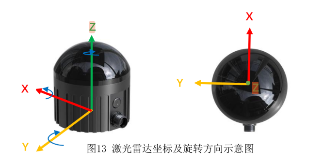

# ros2_object

[livox_ros_driver2_node-1]   what():  Could not load library dlopen error: liblivox_lidar_sdk_shared.so: cannot open shared object file: No such file or directory, at ./src/shared_library.c:99

```
sudo ldconfig
```

神人airy imu坐标系完全对不上，下图是错误示范 z反向，xy互换


